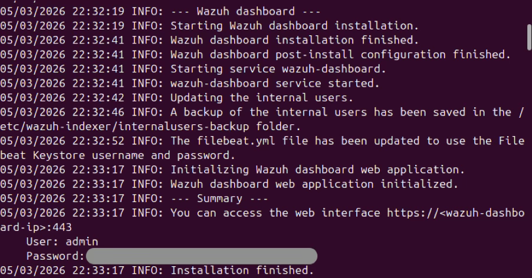

# Wazuh Installation Guide

## Stage 1: Wazuh Central Components Installation (Ubuntu)
The fastest way to install the Wazuh central components on a single host is using the automated installation assistant. Follow the instructions provided here: https://documentation.wazuh.com/current/quickstart.html. 

1. Download and run the Wazuh installation script as root. Note that the `-a` flag is set for all-in-one installation:
```bash
sudo su
curl -sO https://packages.wazuh.com/4.14/wazuh-install.sh && sudo bash ./wazuh-install.sh -a
```

2. Save the credentials provided after installation completes.


3. Login to the Wazuh Dashboard:
```bash
https://<WAZUH_DASHBOARD_IP>
```

## Stage 2: Wazuh Agent Deployment (Kali Linux)
Autogenerate the deployment command via the Wazuh Dashboard UI to ensure the correct syntax and latest package version is used.

1. On the Wazuh dashboard's Overview, click any link on the AGENTS SUMMARY panel to go to the Endpoints summary page
2. On the Endpoints summary page, click "+ Deploy new agent" and follow the instructions to generate the deployment command.
3. Run the generated command on the Kali Linux VM (or other endpoint):
```bash
wget https://packages.wazuh.com/4.x/apt/pool/main/w/wazuh-agent/wazuh-agent_4.14.3-1_arm64.deb && sudo WAZUH_MANAGER=<WAZUH_MANAGER_IP> dpkg -i ./wazuh-agent_4.14.3-1_arm64.deb
```
4. Enable and start the agent service:
```bash
sudo systemctl daemon-reload
sudo systemctl enable wazuh-agent
sudo systemctl start wazuh-agent
```

## Stage 3: Tuning alerts on initial setup
Upon initial setup, you may notice that alerts with medium and low severity are generated at a very high volume.

Pivot to the Wazuh Dashboard visualization section to pinpoint exactly which rules are causing these high-volume alerts. To do this:
1. Click the menu icon (☰) in the top-left corner of the Wazuh Dashboard.
2. Under the **Explore** section, select **Visualize**.
3. Click "+ Create visualization" and select **Data table**. Utilize the fields `rule.id`, `rule.description`, and `rule.description` to spot rules generating the most volume.
4. Under the **Discover** section, you can filter using the same DQL queries to further investigate specific patterns.
5. If noisy alerts are identified, suppression can be done through creating rules with `level="0"` under the custom rule file `/var/ossec/etc/rules/local_rules.xml`.

For example, to view and suppress alerts related to AppArmor (Rule ID 52002):

- Use DQL query to investigate the related alerts 
```bash 
rule.id:52002 and full_log:"apparmor*DENIED"
```

- Add the rule to suppress the alert
```xml
<group name="local, custom_suppression">
  <!-- 
    Suppress noisy AppArmor DENIED alerts (Rule 52002) caused by the Chromium snap package. 
    Snap applications use strict AppArmor profiles for confinement. Chromium frequently attempts 
    to access system resources that are restricted by its profile, generating a high volume of 
    benign "DENIED" logs. This rule silences these specific Chromium alerts to reduce noise, 
    while preserving AppArmor monitoring for other processes.
  -->
  <rule id="100000" level="0">
    <if_sid>52002</if_sid>
    <decoded_as>kernel</decoded_as>
    <match>profile="snap.chromium.chromium"</match>
    <description>Suppressed noisy alert for apparmor with profile "snap.chromium.chromium"</description>
  </rule>
</group>
```
